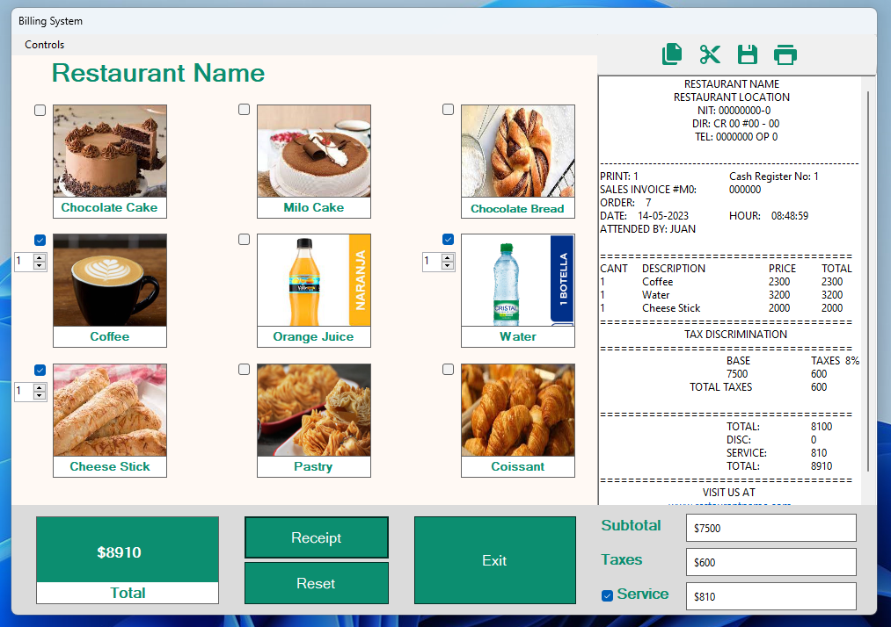
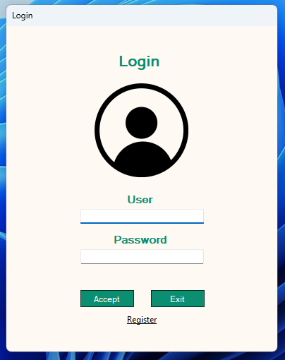
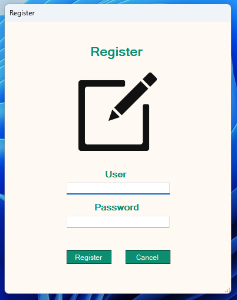
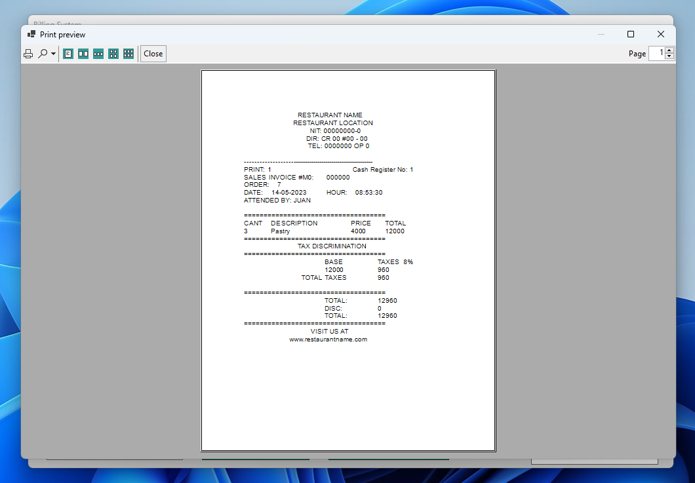
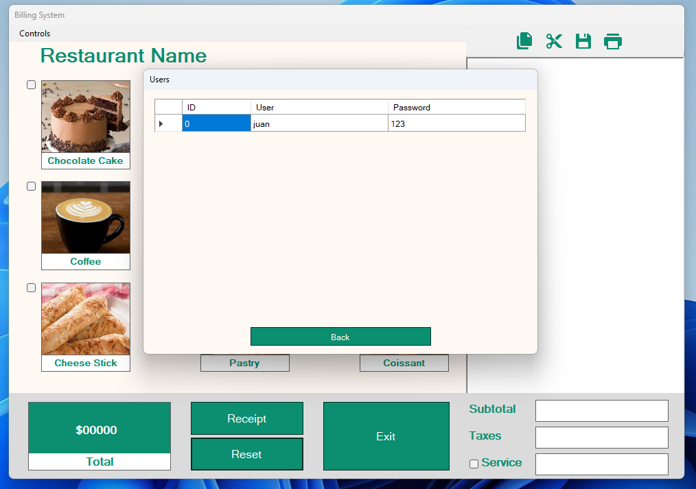
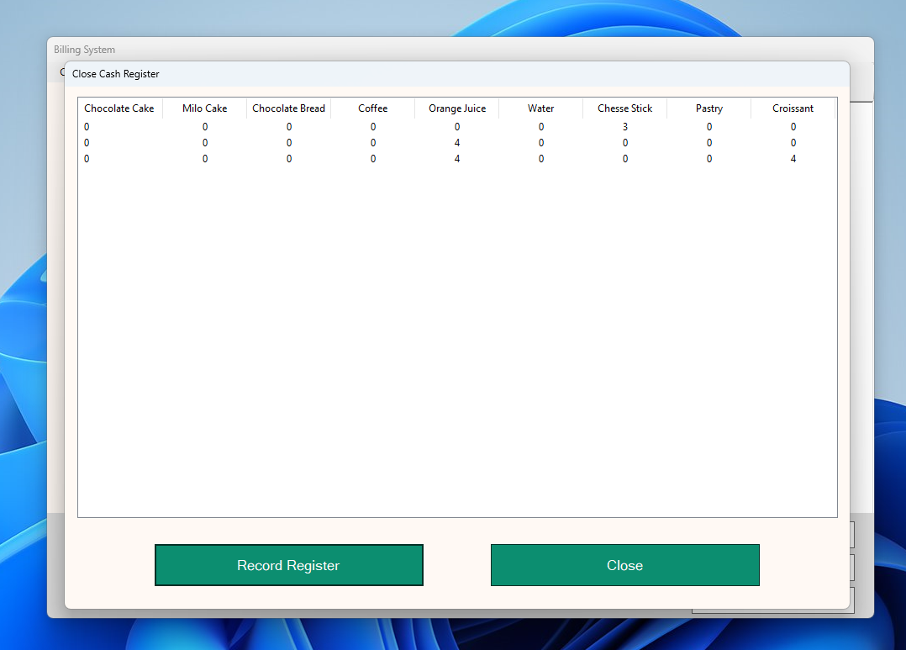

# Billing System

This C# project is a simple billing system designed for use in restaurants and coffee shops. The system allows businesses to add products to customer bills, preview them, print them, and save them. With a straightforward user interface, it streamlines the billing process and enhances the customer experience.

## Technologies

- C#
- .NET Framework 4.5

## Getting Started

To get started with the billing system, simply download or clone the repository to your local machine. Then, open the project in your preferred C# development environment.

### Prerequisites

- Visual Studio or another C# development environment
- .NET Framework 4.5 or higher

### Running the System

To run the billing system, build and run the project in your development environment. Once the application is running, you can add products to customer bills, preview them, print them, and save them.

## Features

The billing system has the following features:

- Adding products to customer bills
- Previewing and printing customer bills
- Saving customer bills
- Viewing and managing users (admin only)
- Getting a report of sales (admin only)

## Screenshots

<section align="center">
    
    
    
    
    
    
</section>
